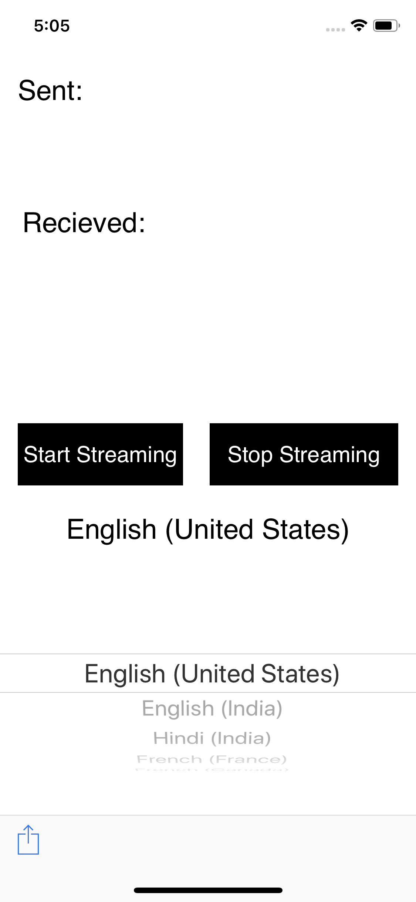

# Speech Translator Chat App

***The "Speech Translator Chat App" is an iOS app that aims at solving the language barrier problem. Using this app two people who speak different languages can communicate with each other seamlessly.***



# Usage

**1.** Install the app on an iPhone.

**2.** Either Host a Translation session or Join an existing session (at a time, 7 people can join a chat session).

**3.** Every user can select their preferred language in which they speak in the app.

**4.** Click on Start Streaming button and speak in your preferred language.

**5.** The app takes in the speech and converts into the preferred language.

**6.** All other users in the session recieve this message and see it in their preferred language using translation service.

**7.** This communication is a two way communocation. Hence, anyone in the session can send and recieve the text.


# References

**1. Google Cloud Speech Streaming gRPC Swift Sample iOS App**
```
https://github.com/GoogleCloudPlatform/ios-docs-samples/tree/master/speech/Swift/Speech-gRPC-Streaming
```

**2. Google Cloud Text Translation API**
```
https://cloud.google.com/translate/docs/translating-text#translate_translate_text-cli-curl
```
